# Лабораторна робота 1. Робота з СУБД PostgreSQL та основи SQL

## Загальна інформація

**Здобувач освіти:** [Матяш Дарія Сергіївна]
**Група:** [ІПЗ-31]
**Обраний рівень складності:** [2]

## Виконання завдань

### РІВЕНЬ 1

### Список таблиць

```sql
-- Запит для отримання списку таблиць
SELECT table_name
FROM information_schema.tables
WHERE table_schema = 'public'
ORDER BY table_name;
```

Результат: У базі даних створено 8 основних таблиць: categories, customers, employees, order_items, orders, products, regions, suppliers.
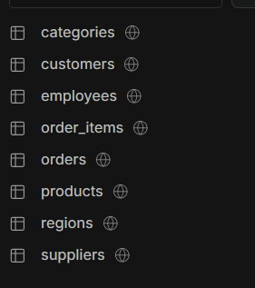


...


### Отримати всі записи з таблиці customers.
```sql
SELECT * FROM customers;
```
Результат: Отримано 15 записів клієнтів (фізичні та юридичні особи з різних міст України).
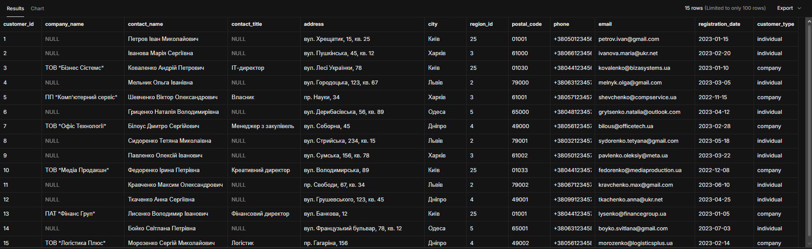

### Вивести назви товарів та їхні ціни
```sql
SELECT product_name, unit_price FROM products;
```
Результат: Отримано перелік усіх товарів із вказанням їхньої вартості.
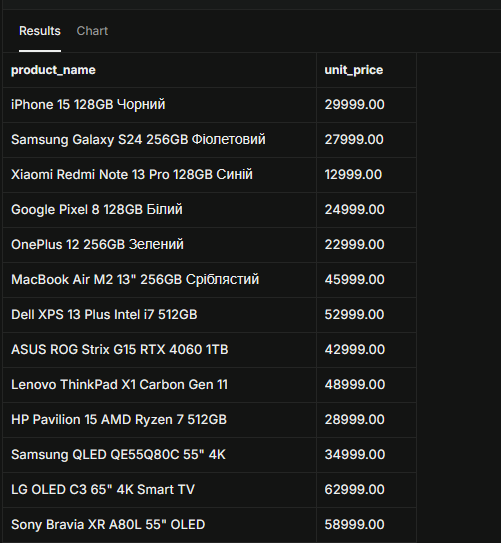
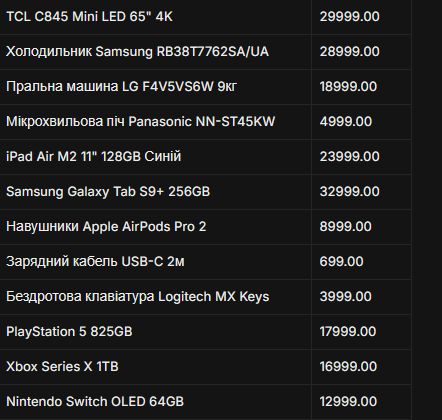

### Показати контактні дані співробітників
```sql
SELECT first_name, last_name, phone, email FROM employees;
```
Результат: Отримано список працівників з їхніми номерами телефонів та електронними поштами.
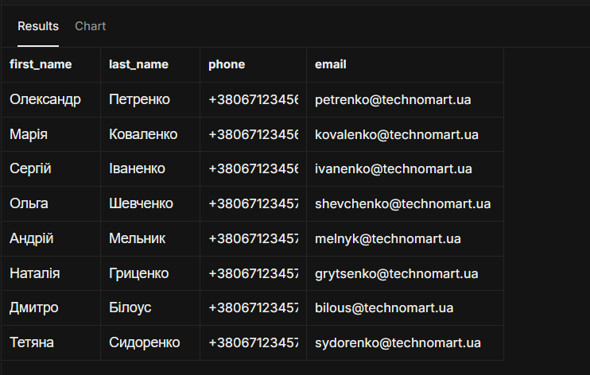

### Клієнти з міста Київ
```sql
SELECT * FROM customers WHERE city = 'Київ';
```
Результат: Знайдено клієнтів, які зареєстровані в місті Київ.
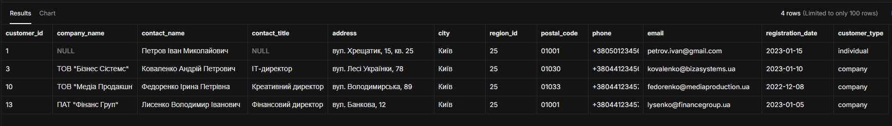

### Товари дорожчі за 25000 грн
```sql
SELECT * FROM products WHERE unit_price > 25000;
```
Результат: Отримано список преміальних товарів з ціною понад 25000 грн.
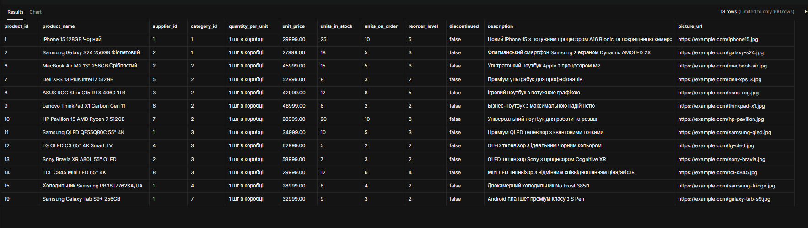

### Замовлення зі статусом 'delivered'
```sql
SELECT * FROM orders WHERE order_status = 'delivered';
```
Результат: Відфільтровано всі успішно доставлені замовлення.
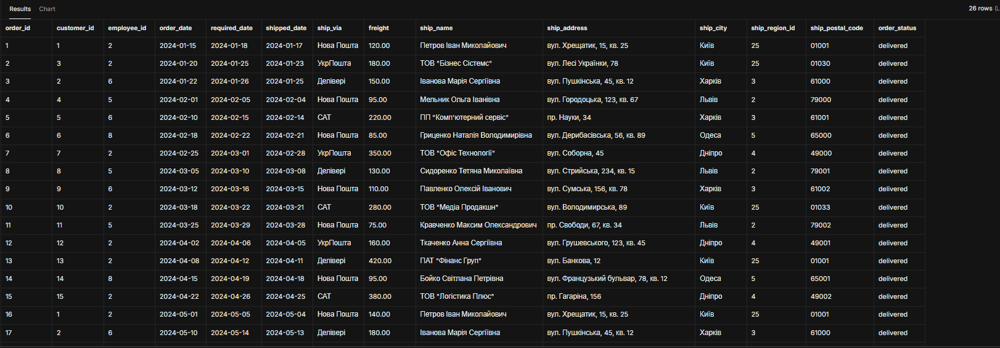
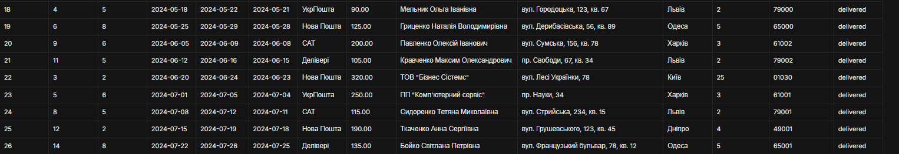

### Співробітники відділу продажів
```sql
SELECT * FROM employees WHERE title ILIKE '%продаж%';
```
Результат: Отримано список співробітників, які працюють у відділі продажів.
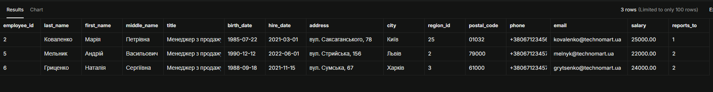

### Товари за зростанням ціни
```sql
SELECT * FROM products ORDER BY unit_price ASC;
```
Результат: Товари відсортовано від найдешевшого до найдорожчого.
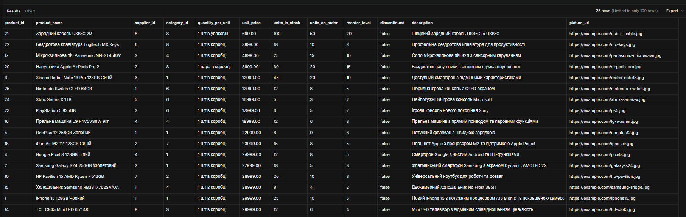
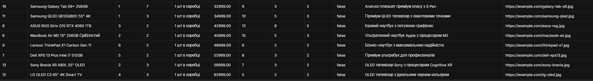

### Клієнти в алфавітному порядку
```sql
SELECT * FROM customers ORDER BY contact_name ASC;
```
Результат: Перелік клієнтів впорядковано за за алфавітом (А-Я).
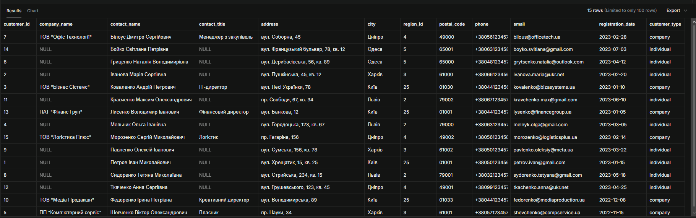

### Замовлення від найновіших до найстаріших
```sql
SELECT * FROM orders ORDER BY order_date DESC;
```
Результат: Замовлення відсортовано за датою у зворотному хронологічному порядку.
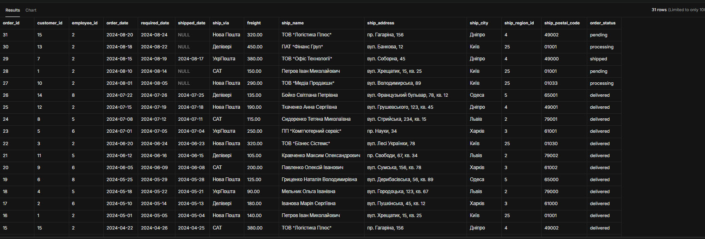
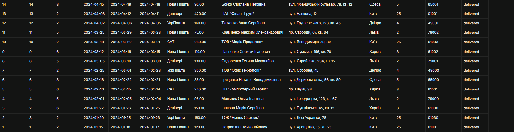

### Перші 10 найдорожчих товарів
```sql
SELECT * FROM products ORDER BY unit_price DESC LIMIT 10;
```
Результат: Отримано топ-10 товарів з найвищою ціною.
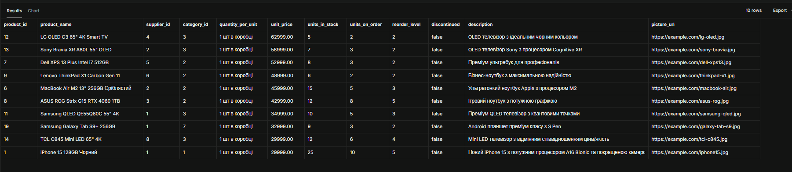

### 5 останніх замовлень
```sql
SELECT * FROM orders ORDER BY order_date DESC LIMIT 5;
```
Результат: Отримано 5 найновіших замовлень у системі.
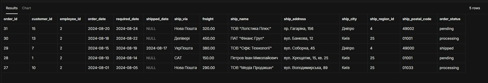

### Перші 8 клієнтів за алфавітом
```sql
SELECT * FROM customers ORDER BY contact_name ASC LIMIT 8;
```
Результат: Виведено перших 8 клієнтів за алфавітним списком.
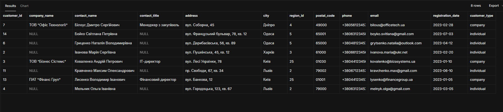

### РІВЕНЬ 2

### Пошук клієнтів на ім'я Іван
```sql
SELECT * FROM customers WHERE contact_name LIKE 'Іван%';
```
Результат: Знайдено всіх клієнтів, ім'я яких починається на 'Іван'.
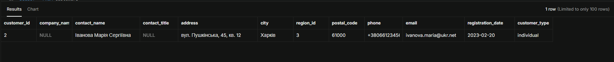

### Пошук телефонів у назві товарів
```sql
SELECT * FROM products WHERE product_name ILIKE '%phone%' OR product_name ILIKE '%телефон%';
```
Результат: Отримано всі товари, які є телефонами або смартфонами.
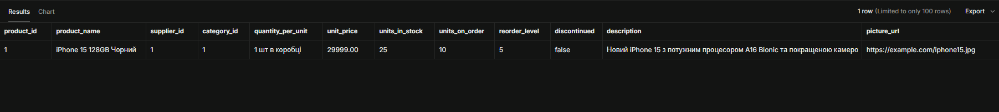

### Маркетингова розсилка для користувачів Gmail
```sql
SELECT * FROM customers WHERE email LIKE '%@gmail.com';
```
Результат: Знайдено клієнтів із поштовими скриньками на домені gmail.com.
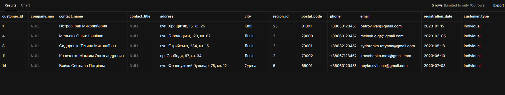

### Пошук товарів версії 'Pro'
```sql
SELECT * FROM products WHERE product_name LIKE '%Pro';
```
Результат: Виведено товари, назва яких закінчується на 'Pro'.
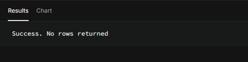

### Перевірка співробітників на ім'я Олександр
```sql
SELECT * FROM employees WHERE first_name LIKE '%Олександр%' OR last_name LIKE '%Олександр%';
```
Результат: Знайдено співробітників з ім'ям або прізвищем Олександр.
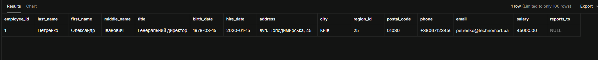

### Товари в ціновому діапазоні від 15000 до 50000
```sql
SELECT * FROM products WHERE unit_price > 15000 AND unit_price < 50000;
```
Результат: Виведено товари середньої цінової категорії.
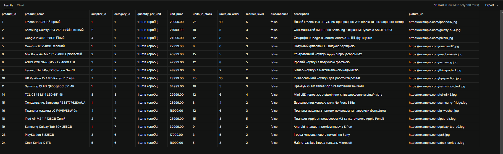

### Компанії з Києва або Львова
```sql
SELECT * FROM customers WHERE (city = 'Київ' OR city = 'Львів') AND customer_type = 'company';
```
Результат: Знайдено корпоративних клієнтів із Києва або Львова.
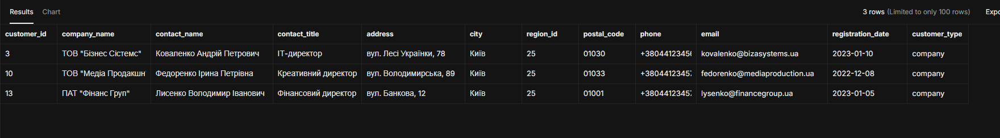

### Не-доставлені замовлення за 2024 рік
```sql
SELECT * FROM orders WHERE order_date >= '2024-01-01' AND order_status != 'delivered';
```
Результат: Отримано замовлення за 2024 рік, які ще перебувають у процесі обробки/доставки.
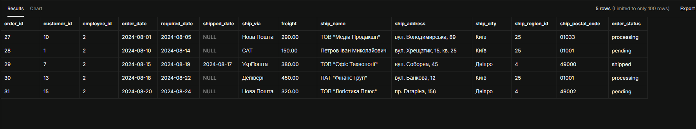

### Актуальні товари в наявності (понад 20 шт.)
```sql
SELECT * FROM products WHERE units_in_stock > 20 AND NOT discontinued;
```
Результат: Виведено товари, які є в достатній кількості на складі та не зняті з виробництва.
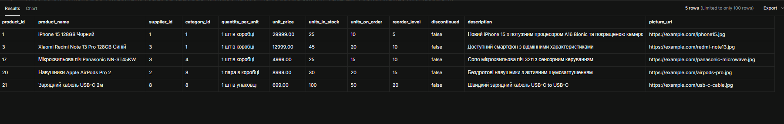

### Клієнти з міст-мільйонників (Київ, Дніпро)
```sql
SELECT * FROM customers WHERE city = 'Київ' OR city = 'Дніпро';
```
Результат: Отримано перелік клієнтів із Києва та Дніпра.
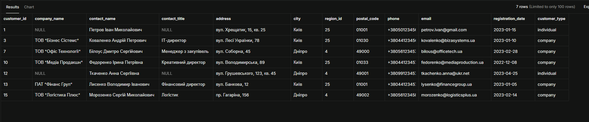

### Пошук персоналу поза посадою менеджера
```sql
SELECT * FROM employees WHERE title NOT ILIKE '%менеджер%';
```
Результат: Знайдено співробітників, які не займають керівні/менеджерські посади.
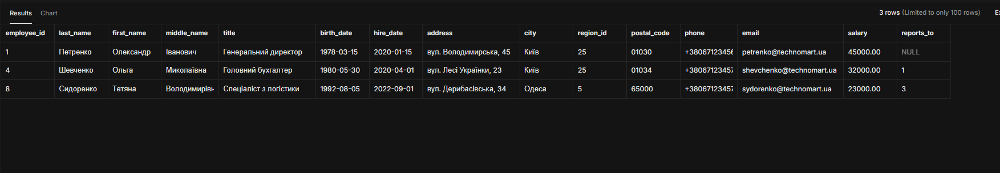

### Клієнти з великих міст (IN)
```sql
SELECT * FROM customers WHERE city IN ('Київ', 'Харків', 'Одеса', 'Дніпро');
```
Результат: Відфільтровано клієнтів з указаного переліку 4 міст.
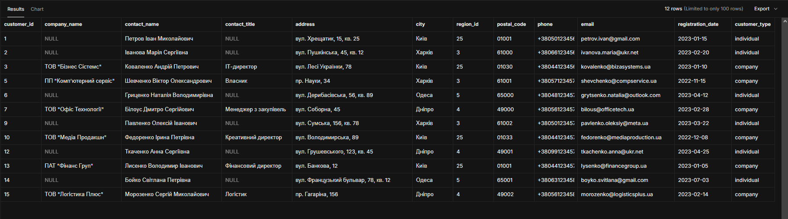

### Товари з ціною від 10000 до 30000 (BETWEEN)
```sql
SELECT * FROM products WHERE unit_price BETWEEN 10000 AND 30000;
```
Результат: Отримано товари в заданому діапазоні цін.
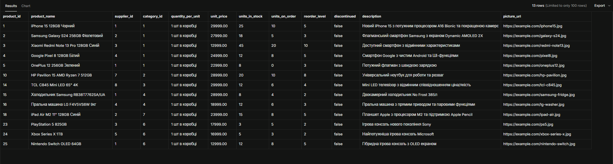

### Замовлення у робочих статусах (IN)
```sql
SELECT * FROM orders WHERE order_status IN ('processing', 'shipped', 'delivered');
```
Результат: Відфільтровано замовлення за 3 активними статусами.

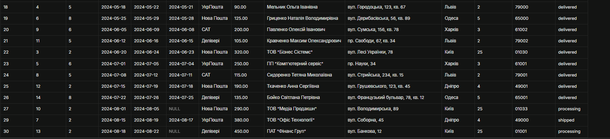

### Товари конкретних категорій (IN)
```sql
SELECT * FROM products WHERE category_id IN (1, 3, 5);
```
Результат: Виведено товари, що належать до категорій 1, 3 або 5.
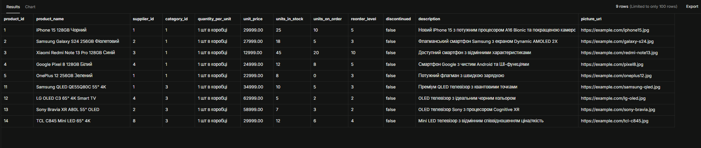

### Замовлення за 2024 рік (BETWEEN)
```sql
SELECT * FROM orders WHERE order_date BETWEEN '2024-01-01' AND '2024-12-31';
```
Результат: Знайдено всі замовлення, зроблені протягом 2024 року.
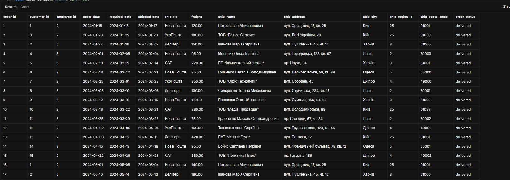
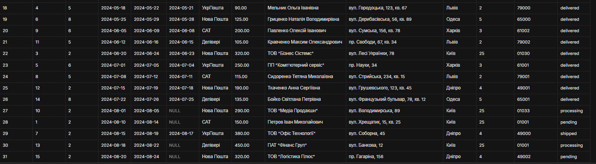

### Оптимальні складські залишки (BETWEEN)
```sql
SELECT * FROM products WHERE units_in_stock BETWEEN 10 AND 50;
```
Результат: Виведено товари із залишками на складі від 10 до 50 одиниць.
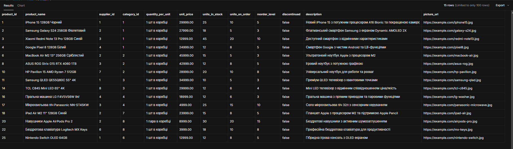

### Пошук приватних осіб (IS NULL)
```sql
SELECT * FROM customers WHERE company_name IS NULL;
```
Результат: Знайдено клієнтів, у яких відсутній запис про назву компанії (фізичні особи).
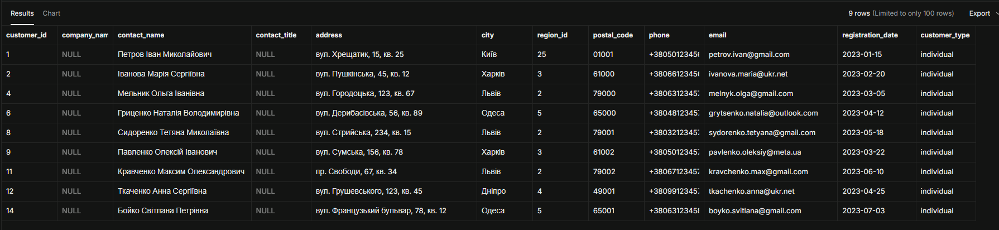

### Фактично відправлені замовлення (IS NOT NULL)
```sql
SELECT * FROM orders WHERE shipped_date IS NOT NULL;
``` 
Результат: Отримано замовлення, які вже мають заповнену дату відправки.
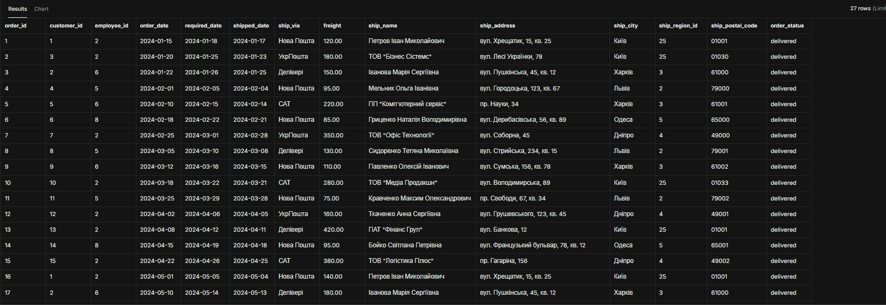
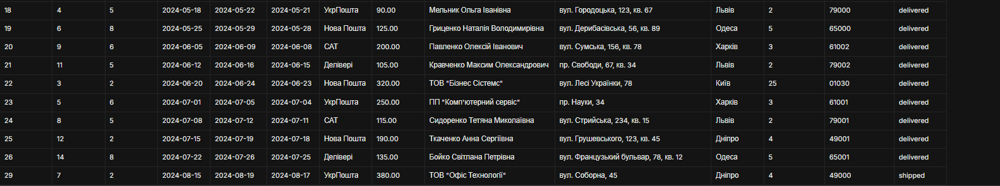

### Пошук техніки Samsung/Apple середнього цінового сегменту
```sql
SELECT * FROM products 
WHERE (product_name ILIKE '%Samsung%' OR product_name ILIKE '%Apple%') 
  AND unit_price BETWEEN 10000 AND 40000;
```
Результат: Знайдено смартфони/техніку Samsung та Apple у діапазоні ціни від 10000 до 40000 грн.
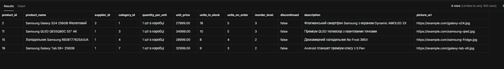

### B2B-клієнти у Києві та Одесі
```sql
SELECT * FROM customers 
WHERE city IN ('Київ', 'Одеса') 
  AND customer_type = 'company';
```
Результат: Отримано юридичних осіб з осередками в Києві чи Одесі.
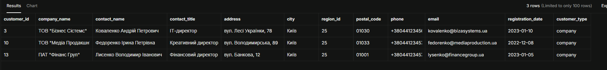

### Доставлені замовлення за 2024 рік
```sql
SELECT * FROM orders 
WHERE order_status = 'delivered' 
  AND order_date BETWEEN '2024-01-01' AND '2024-12-31';
```
Результат: Відфільтровано успішно доставлені замовлення, що відбулися у 2024 році.
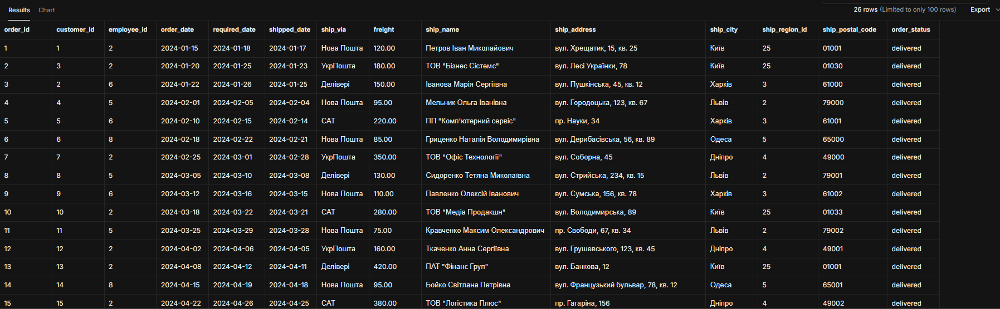
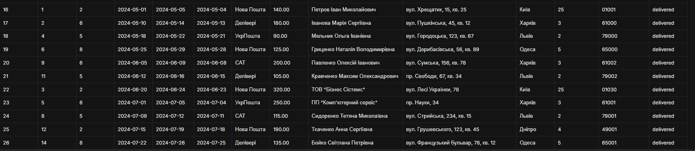

### Товари з нестандартною ціною або без опису
```sql
SELECT * FROM products 
WHERE (unit_price NOT BETWEEN 5000 AND 20000) 
   OR description IS NULL;
```
Результат: Знайдено товари, ціна яких поза діапазоном 5000-20000 грн або які не мають опису.
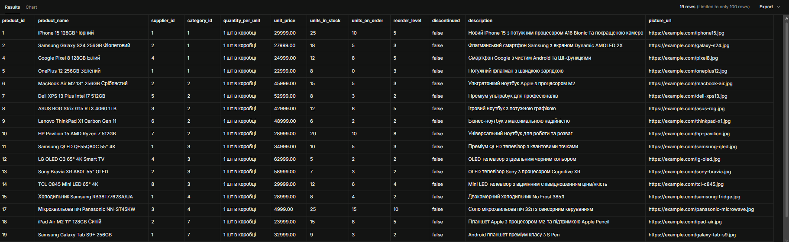
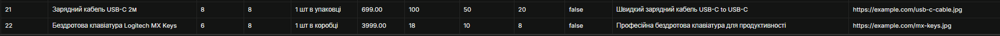

### Менеджери з продажів із наявним телефоном
```sql
SELECT * FROM employees 
WHERE title ILIKE '%продаж%' 
  AND phone IS NOT NULL;
```
Результат: Отримано працівників відділу продажів, у яких заповнено контактний номер телефону.
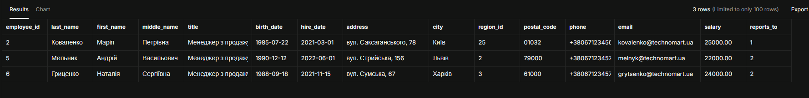

### Сортування клієнтів за містом та контакти за алфавітом
```sql
SELECT * FROM customers ORDER BY city ASC, contact_name ASC;
```
Результат: Клієнтів згруповано за містом, а всередині кожного міста — за алфавітним порядком контактних осіб.
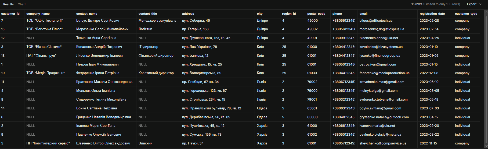

### Сортування товарів за ціною та залишками
```sql 
SELECT * FROM products ORDER BY unit_price DESC, units_in_stock DESC;
```
Результат: Товари впорядковано за спаданням ціни, а товари з однаковою ціною — за спаданням кількості на складі.
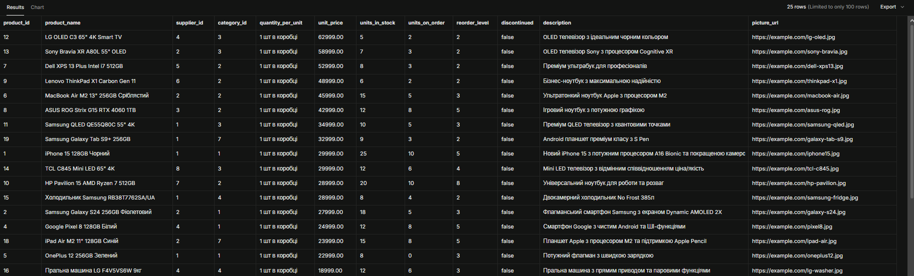
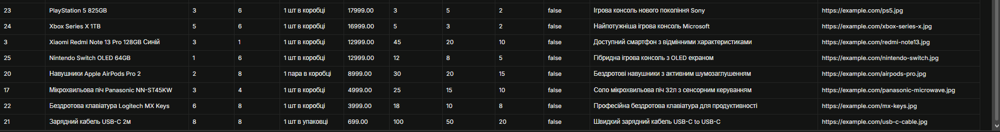

### Моніторинг замовлень за статусом та датою
```sql
SELECT * FROM orders ORDER BY order_status ASC, order_date DESC;
```
Результат: Замовлення згруповано за статусом виконання, від найновіших до найстаріших у кожній категорії.
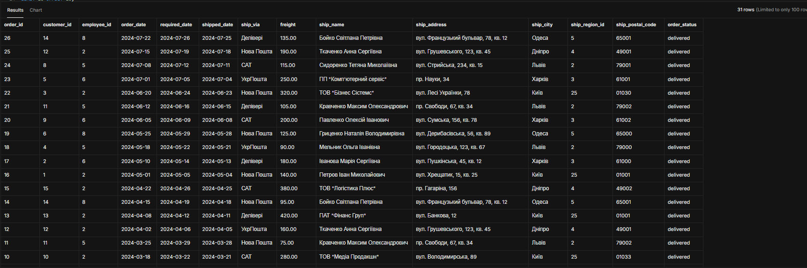
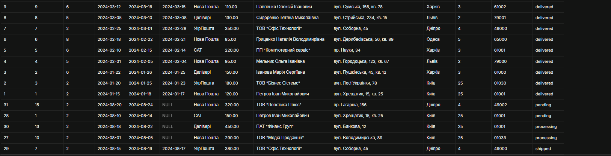

### Пагінація: 2-га сторінка каталогу (по 10 товарів)
```sql
SELECT * FROM products ORDER BY product_name ASC LIMIT 10 OFFSET 10;
```
Результат: Отримано 10 товарів другої сторінки каталогу (з 11 по 20 позицію).
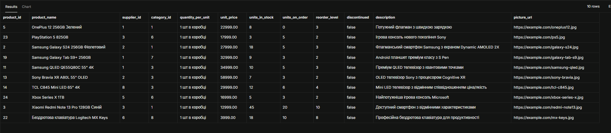

### Пагінація: 3-тя сторінка найновіших замовлень (по 5 замовлень)
```sql
SELECT * FROM orders ORDER BY order_date DESC LIMIT 5 OFFSET 10;
```
Результат: Отримано 5 замовлень третьої сторінки списку (з 11 по 15 найновіше замовлення).
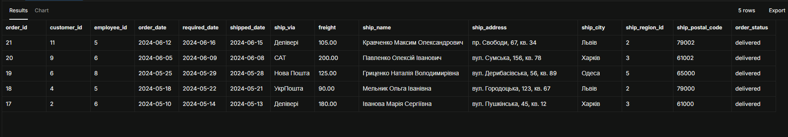

## Висновки

**Самооцінка**: [4]

**Обгрунтування**: [У ході лабораторної роботи успішно розгорнуто навчальну базу даних `technomart` у СУБД PostgreSQL (Supabase) та виконано основну частину завдань Рівня 1 і Рівня 2. Реалізовано SQL-запити для вибірки, фільтрації (WHERE, LIKE, ILIKE, IN, BETWEEN, IS NULL), комбінування умов та пагінації результатів. Для кожного завдання наведено відповідний SQL-код, опис результату та підтверджуючий скріншот із середовища виконання.]
