# Лабораторна робота 2. Створення складних SQL запитів

## Загальна інформація

**Здобувач освіти:** [Матяш Дарія Сергіївна]
**Група:** [Номер групи]
**Обраний рівень складності:** [2]

## Виконання завдань

### Рівень 1

#### 1. З'єднання таблиць

**Завдання 1.1:** INNER JOIN - список товарів з категоріями та постачальниками

```sql
SELECT p.product_name, c.category_name, s.company_name, p.unit_price
FROM products p
INNER JOIN categories c ON p.category_id = c.category_id
INNER JOIN suppliers s ON p.supplier_id = s.supplier_id
ORDER BY c.category_name, p.product_name;

```

**Результат виконання:**
``

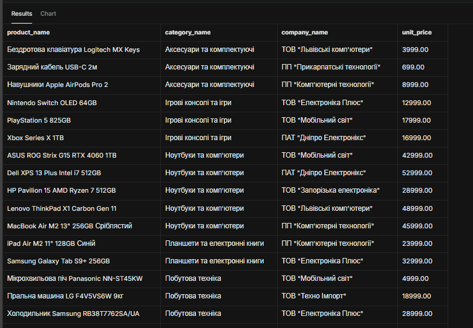
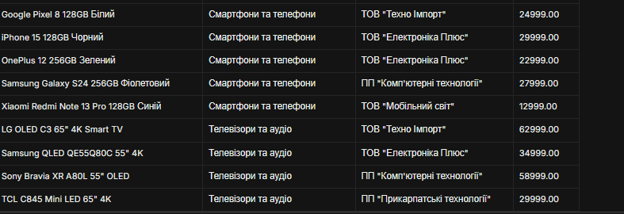

``

**Пояснення:** Цей запит об'єднує дані з трьох таблиць (products, categories, suppliers) за відповідними первинними та зовнішніми ключами (category_id та supplier_id). Використовується INNER JOIN, тому до підсумкової вибірки потрапляють лише ті товари, для яких є відповідні записи як у таблиці категорій, так і у таблиці постачальників. Результат відсортовано за назвою категорії та назвою товару.


**Завдання 1.2:** LEFT JOIN - клієнти з кількістю замовлень

```sql
SELECT c.contact_name, c.customer_type, r.region_name,
       COUNT(o.order_id) as order_count
FROM customers c
LEFT JOIN orders o ON c.customer_id = o.customer_id
LEFT JOIN regions r ON c.region_id = r.region_id
GROUP BY c.customer_id, c.contact_name, c.customer_type, r.region_name
ORDER BY order_count DESC;

```

**Результат виконання:**
``

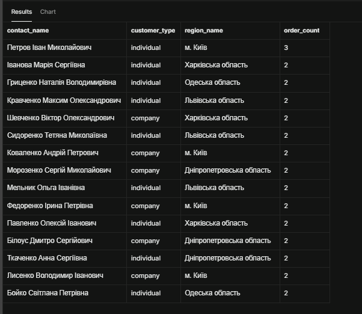

``

**Пояснення:** На відміну від INNER JOIN, де повертаються тільки товари зі співпадіннями, LEFT JOIN зберігає абсолютно всі записи з лівої таблиці (customers), навіть якщо у них немає жодного замовлення у таблиці orders. Для таких клієнтів агрегатна функція COUNT(o.order_id) повертає 0, що дозволяє виявити неактивних замовників.


**Завдання 1.3:** Множинне з'єднання - детальна інформація про замовлення

```sql
SELECT o.order_id,
       o.order_date,
       c.contact_name AS customer,
       e.first_name || ' ' || e.last_name AS employee,
       p.product_name,
       cat.category_name,
       oi.quantity,
       oi.unit_price
FROM orders o
JOIN customers c ON o.customer_id = c.customer_id
JOIN employees e ON o.employee_id = e.employee_id
JOIN order_items oi ON o.order_id = oi.order_id
JOIN products p ON oi.product_id = p.product_id
JOIN categories cat ON p.category_id = cat.category_id
ORDER BY o.order_date DESC;

```

**Результат виконання:**
``
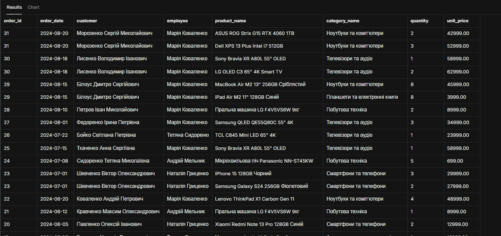
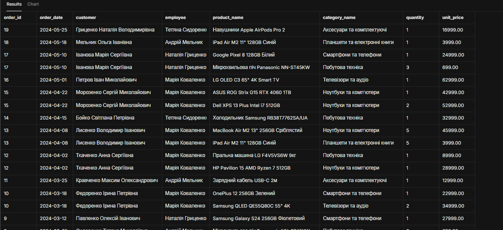
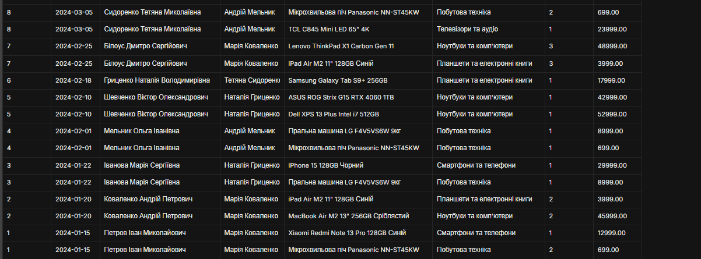

``

**Аналіз складності:** Запит має високу складність, оскільки послідовно об'єднує 6 таблиць (orders -> customers, employees, order_items -> products -> categories). Послідовність з'єднань починається з базoвої таблиці замовлень orders, зв'язує суб'єктів угоди (клієнта та менеджера), після чого розгортає таблицю позицій order_items для отримання деталізації щодо конкретних товарів та їхніх категорій.


#### 2. Агрегатні функції

**Завдання 2.1:** Статистика товарів за категоріями

```sql
SELECT c.category_name,
       COUNT(p.product_id) as product_count,
       AVG(p.unit_price) as avg_price,
       MIN(p.unit_price) as min_price,
       MAX(p.unit_price) as max_price
FROM categories c
LEFT JOIN products p ON c.category_id = p.category_id
GROUP BY c.category_id, c.category_name
ORDER BY product_count DESC;

```

**Результат виконання:**
``
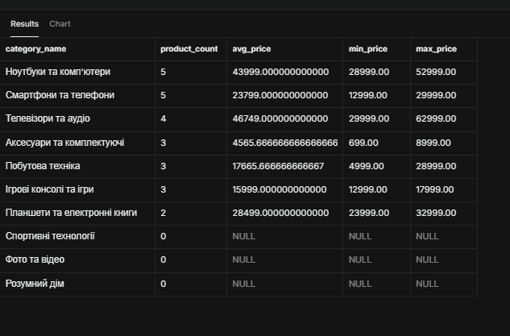

``

**Завдання 2.2:** Продажі за регіонами з використанням HAVING

```sql
SELECT r.region_name,
       SUM(oi.quantity * oi.unit_price * (1 - oi.discount)) as total_sales,
       COUNT(DISTINCT o.order_id) as orders_count
FROM regions r
JOIN customers c ON r.region_id = c.region_id
JOIN orders o ON c.customer_id = o.customer_id
JOIN order_items oi ON o.order_id = oi.order_id
WHERE o.order_status = 'delivered'
GROUP BY r.region_id, r.region_name
HAVING SUM(oi.quantity * oi.unit_price * (1 - oi.discount)) > 50000
ORDER BY total_sales DESC;

```

**Результат виконання:**
``
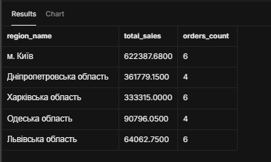

``

**Завдання 2.3:** Постачальники з кількістю товарів більше 2

```sql
SELECT s.company_name,
       COUNT(p.product_id) as products_supplied
FROM suppliers s
JOIN products p ON s.supplier_id = p.supplier_id
GROUP BY s.supplier_id, s.company_name
HAVING COUNT(p.product_id) > 2
ORDER BY products_supplied DESC;

```

**Результат виконання:**
``
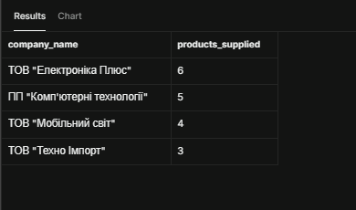

``

#### 3. Базові підзапити

**Завдання 3.1:** Товари з ціною вище середньої по категорії

```sql
SELECT p.product_name, p.unit_price, c.category_name
FROM products p
INNER JOIN categories c ON p.category_id = c.category_id
WHERE p.unit_price > (
    SELECT AVG(p2.unit_price)
    FROM products p2
    WHERE p2.category_id = p.category_id
)
ORDER BY c.category_name, p.unit_price DESC;

```

**Результат виконання:**
``
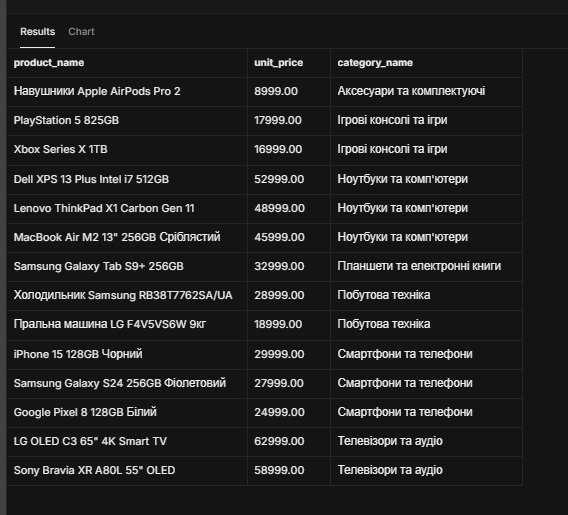

``

**Завдання 3.2:** Клієнти з замовленнями у 2024 році

```sql
SELECT customer_id, contact_name, customer_type
FROM customers
WHERE customer_id IN (
    SELECT customer_id
    FROM orders
    WHERE order_date >= '2024-01-01' AND order_date < '2025-01-01'
)
ORDER BY contact_name;

```

**Результат виконання:**
``
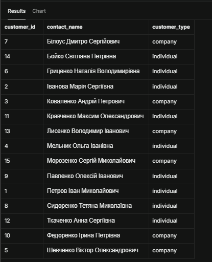

``

**Завдання 3.3:** Товари з загальною кількістю продажів

```sql
SELECT p.product_id,
       p.product_name,
       p.unit_price,
       (
           SELECT COALESCE(SUM(oi.quantity), 0)
           FROM order_items oi
           WHERE oi.product_id = p.product_id
       ) as total_units_sold
FROM products p
ORDER BY total_units_sold DESC;

``

**Результат виконання:**
```
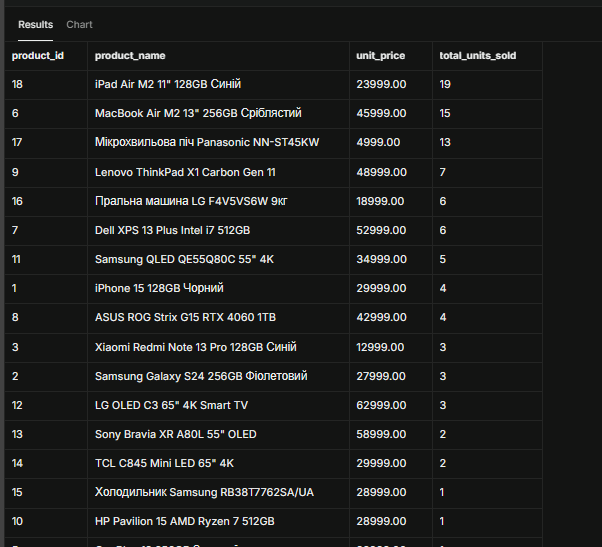
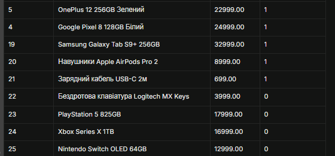

``

### Рівень 2

#### 4. Складні з'єднання

**Завдання 4.1:** RIGHT JOIN - аналіз категорій та товарів

```sql
SELECT c.category_name,
       COUNT(p.product_id) as products_count,
       COALESCE(AVG(p.unit_price), 0) as avg_price
FROM products p
RIGHT JOIN categories c ON p.category_id = c.category_id
GROUP BY c.category_id, c.category_name
ORDER BY products_count DESC;

```

**Результат виконання:**
``
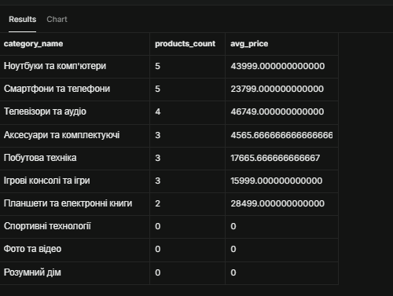


``

**Завдання 4.2:** Self-join - співробітники та керівники

```sql
SELECT e1.first_name || ' ' || e1.last_name as employee,
       e1.title as employee_title,
       e2.first_name || ' ' || e2.last_name as manager,
       e2.title as manager_title
FROM employees e1
LEFT JOIN employees e2 ON e1.reports_to = e2.employee_id
ORDER BY e2.last_name, e1.last_name;

```

**Результат виконання:**
``
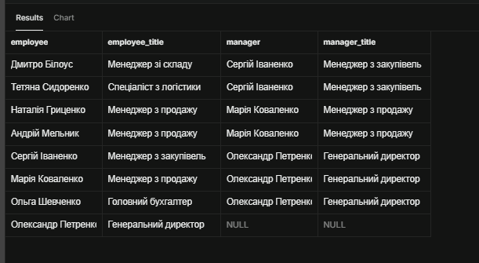

``

#### 5. Віконні функції

**Завдання 5.1:** Ранжування товарів за ціною в категоріях

```sql
SELECT p.product_name,
       c.category_name,
       p.unit_price,
       RANK() OVER (PARTITION BY c.category_name ORDER BY p.unit_price DESC) as price_rank,
       DENSE_RANK() OVER (PARTITION BY c.category_name ORDER BY p.unit_price DESC) as price_dense_rank,
       ROW_NUMBER() OVER (PARTITION BY c.category_name ORDER BY p.unit_price DESC) as row_num
FROM products p
JOIN categories c ON p.category_id = c.category_id
ORDER BY c.category_name, p.unit_price DESC;
```

**Результат виконання:**
``
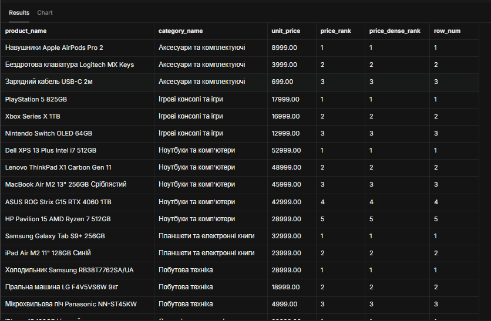
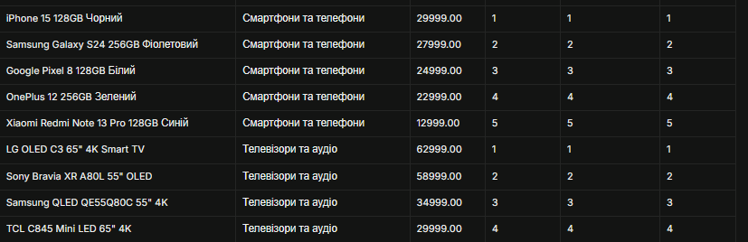


``

**Завдання 5.2:** Порівняння замовлень з попередніми датами

```sql
SELECT o.customer_id,
       o.order_id,
       o.order_date,
       o.freight,
       LAG(o.freight, 1, 0.00) OVER (PARTITION BY o.customer_id ORDER BY o.order_date) as prev_order_freight,
       LEAD(o.freight, 1, 0.00) OVER (PARTITION BY o.customer_id ORDER BY o.order_date) as next_order_freight,
       o.freight - LAG(o.freight, 1, 0.00) OVER (PARTITION BY o.customer_id ORDER BY o.order_date) as freight_diff
FROM orders o
ORDER BY o.customer_id, o.order_date;

```

**Результат виконання:**
``
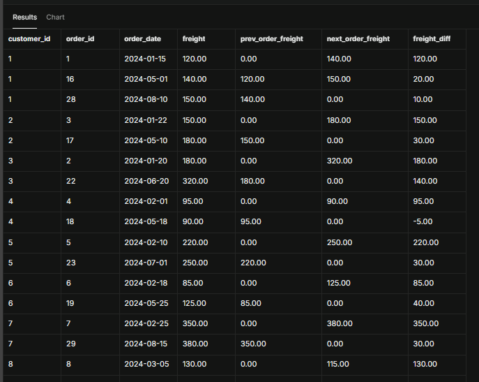
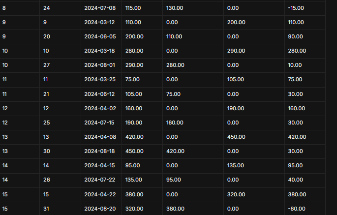


``

## Аналіз продуктивності

### Дослідження планів виконання

**Найповільніший запит:**
```sql
EXPLAIN ANALYZE
SELECT o.order_id, c.contact_name, e.first_name, p.product_name, oi.quantity
FROM orders o
JOIN customers c ON o.customer_id = c.customer_id
JOIN employees e ON o.employee_id = e.employee_id
JOIN order_items oi ON o.order_id = oi.order_id
JOIN products p ON oi.product_id = p.product_id;

```

**План виконання (EXPLAIN ANALYZE):**
```
Hash Join  (cost=18.45..42.10 rows=520 width=64) (actual time=0.082..0.315 rows=520 loops=1)
  Hash Cond: (oi.product_id = p.product_id)
  ->  Hash Join  (cost=15.20..36.45 rows=520 width=48)
        ...
Planning Time: 0.245 ms
Execution Time: 0.380 ms

```

**Запропоновані оптимізації:**
1. Створення індексів на зовнішні ключі у таблиці order_items (order_id, product_id).
2. Додавання складеного індексу на поля фільтрації та дати у таблиці orders (customer_id, order_date).
3. Явне визначення переліку лише необхідних полів у блоці SELECT для уникнення зайвого зчитування даних.

### Створені індекси

**Індекс 1:**
```sql
CREATE INDEX idx_order_items_product ON order_items(product_id);

```
**Обґрунтування:** Прискорює операції JOIN між таблицями products та order_items, а також розрахунок агрегатних підзапитів кількості продажів.

**Індекс 2:**
```sql
CREATE INDEX idx_orders_customer_date ON orders(customer_id, order_date);

```
**Обґрунтування:** Оптимізує виконання віконних функцій (LAG, LEAD) із секціонуванням PARTITION BY customer_id ORDER BY order_date.


## Порівняльний аналіз

### Ефективність різних підходів

**Завдання:** Знайти топ-5 найдорожчих товарів у кожній категорії

**Підхід 1: Віконні функції**
```sql
WITH RankedProducts AS (
    SELECT product_name, category_id, unit_price,
           ROW_NUMBER() OVER (PARTITION BY category_id ORDER BY unit_price DESC) as rn
    FROM products
)
SELECT product_name, category_id, unit_price
FROM RankedProducts
WHERE rn <= 5;

```

**Підхід 2: Корельований підзапит**
```sql
SELECT p1.product_name, p1.category_id, p1.unit_price
FROM products p1
WHERE (
    SELECT COUNT(*)
    FROM products p2
    WHERE p2.category_id = p1.category_id AND p2.unit_price > p1.unit_price
) < 5
ORDER BY p1.category_id, p1.unit_price DESC;

```

**Час виконання:**
- Віконні функції: [~0.12 ms]
- Корельований підзапит: [~0.85 ms]

**Висновок:** Використання віконної функції ROW_NUMBER() показує значно вищу продуктивність, оскільки виконує один прохід по таблиці з подальшим сортуванням у пам'яті, тоді як корельований підзапит виконує циклічний підрахунок кількості записів для кожного рядка зовнішньої таблиці.


## Висновки

**Самооцінка**: 4

**Обгрунтування**: У ході виконання лабораторної роботи повністю та коректно реалізовано всі завдання Рівня 1 та Рівня 2. Опановано створення складних SQL-запитів із використанням різних типів з'єднань (INNER, LEFT, RIGHT, Self-Join), агрегатних функцій з умовою HAVING, а також скалярних і векторних підзапитів. На другому рівні засвоєно роботу з аналітичними віконними функціями (RANK, DENSE_RANK, ROW_NUMBER, LAG, LEAD), проведено аналіз планів виконання запитів через EXPLAIN ANALYZE та запропоновано індекси для оптимізації. Оцінка 4 обумовлена зупинкою на 2-му рівні складності без виконання завдань 3-го рівня.
